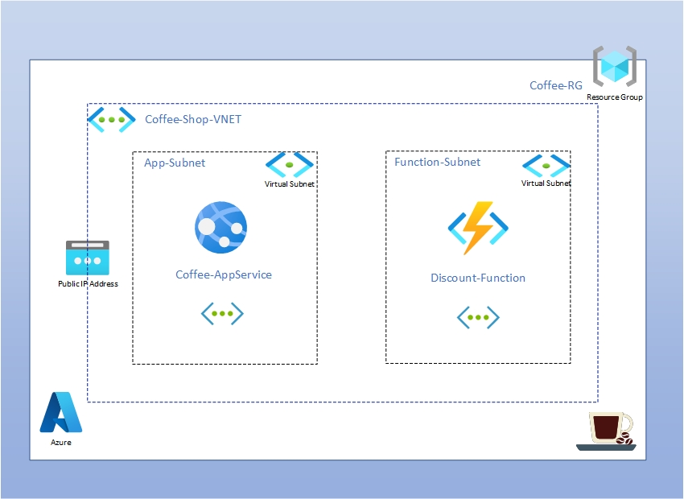
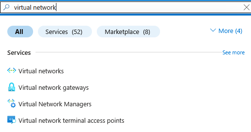
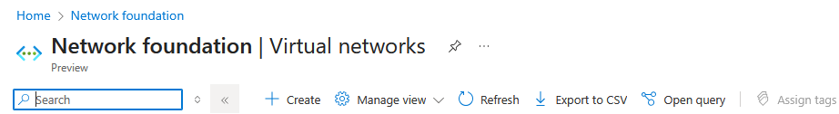
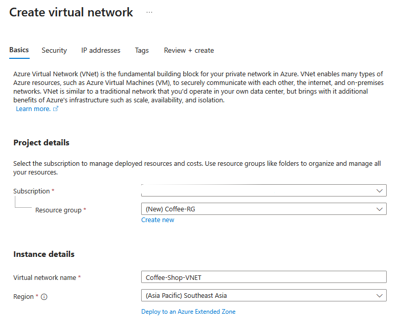
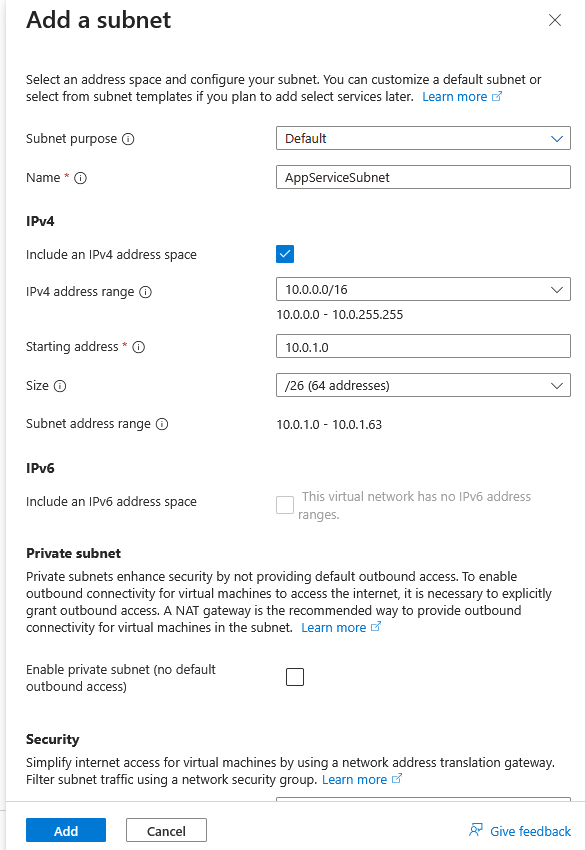
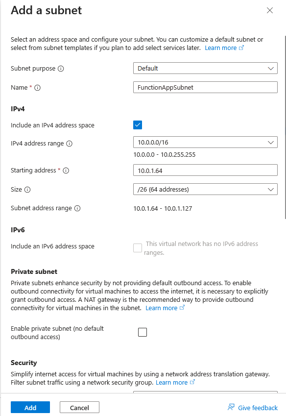
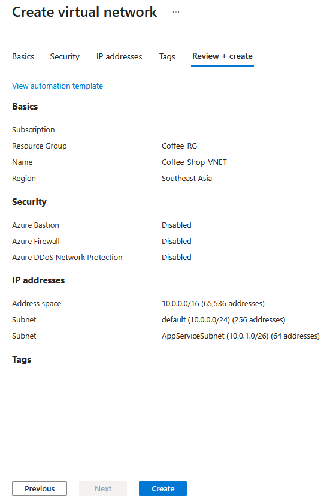

This lab guides you through setting up a secure, internal communication flow between an Azure App Service (hosting a Python frontend) and an Azure Function (providing coffee discount prices). The core of this security is VNet Integration, allowing your App Service to access the Function App privately over a Virtual Network, preventing direct public internet exposure between them. We'll set up dedicated subnets for each service and deploy code using the Azure CLI.

Overview of the lab deployment.

In this initial stage, we'll establish the foundational private network for our services. We will create a new Azure Virtual Network and, crucially, segment it into two distinct subnets. One subnet will be specifically designated for our App Service, and the other for our Azure Function. This segmentation is a best practice for network organization and security.
## Instructions
Create and Configure the Virtual Network (VNet) with Two Subnets:

 <!--We'll start by creating the VNet and two distinct subnets within it, one for the App Service and one for the Function App. -->

1.  Search for Virtual Networks: In the Azure portal search bar, type `Virtual networks` and select it from the results:

      

2. Create a New Virtual Network: Click `+ Create`:
   
   
   
3. Configure Basics:

   * Subscription: Select your Azure subscription.
   * Resource Group: Choose your existing resource group.
   * Name: Provide a unique name for your VNet (e.g. myCoffeeCofee-Shop-VNET).
   * Region: #########
  
      
  

4. Configure IP Addresses:

   On the IP Addresses tab, you'll see a default address space (e.g., 10.0.0.0/16). You can keep this or adjust it.

   Add Subnet 1 (for App Service):

      Click `+ Add a subnet`:

      * Subnet name: AppServiceSubnet
      * Subnet address range: Provide a range, e.g., 10.0.1.0/24 (or /26 for smaller needs).
      * Click `Add`.
  
         

   Add Subnet 2 (for Function App):

      Click `+ Add subnet`:

      * Subnet name: FunctionAppSubnet
      * Subnet address range: Provide a range that doesn't overlap with the first, e.g., 10.0.2.0/24 (or /26).
      * Click `Add`.
          
         
   you can delete or edit existing default subnet.

5. Review and Create: Click `Review + create` and then `Create` once validation passes.
   
      