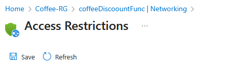

Here, we'll provision the backend logic of our application. We'll create an Azure Function App, which will host our Python function responsible for calculating coffee discounts. The key achievement in this step is integrating this Function App with its dedicated subnet within the VNet. This ensures that any outbound calls from the function (though our function won't make external calls in this scenario, it's a vital security principle) and, more importantly, inbound calls from resources within the VNet can communicate privately. We'll also prepare the function's HTTP trigger and obtain its access key.

## Instructions.

Create Azure Function App and Integrate with Dedicated Subnet

1. In the Azure portal, search for `Function App`:
   
   

2. Select `Flex Consumption` as the SKU for this lab then click `Select`:

   

3. Configure Basics:

      * Subscription: Select your subscription.
      * Resource Group: Select `Coffee-RG`.
      * Function App name: Provide a globally unique name (e.g., coffeeDiscountFunc).
      * Runtime stack: Select `Python`.
      * Version: Choose  `3.12`.
      * Region: Select the same region as your VNet.
      * Instance size: Select `512 MB`
         

    Keep all other configurations in each tab as it is. Here

4. Review and Create: Click `Review + create` then click `Create`:

      

5. In the Azure portal, search for `Function App`and select newly deployed Function app.
      

6. In the left menu, under `Settings`, select `Networking`:
   
      

7. Under Outbound traffic configuration, next to `Virtual network integration`, click `Not Configured` to integrate with vnet:

      

8. Click Add `virtual netqwork integration:`
      

9. Select your Virtual Network:

      * Virtual Network: choose `Coffee-Shop-VNET`
      * Subnet: choose the `FunctionAppSubnet` you created. 
      * Click `Connect`.
         

10. Configure `Inbound Traffic Configuration` to only allow traffic from `Coffee-Shop-VNET` and block all public access:
    
    under `Inbound Traffic Configuration` next to `Public network access`, click `Enabled with no access restrictions`:

      

11. under `Public Access` select option `Enable form select networks and IP addresses`:
      

   This will only allow inbound traffic from the selected vnet and will block all traffic from public internet.

12. under `Site access and rules`, for the `Main site` configurations:
      * set `Unmateched rule action` : deny
      * click `+ Add` to add the allow rule from vnet:
         Name: Give a Rule Name (e.g., Allow Inbound from appVnet)
         Action: Select `Allow`
         Priority : set it to `100`
         Source Settings : Select `Virtual Network`
         Select the subscription
         Virtual Network: select `Coffee-Shop-Vnet`
         Subnet : Select `AppServiceSubnet`
      click `Add rule` to create the inbound rule:

      

13. click on Save: 
    
      

