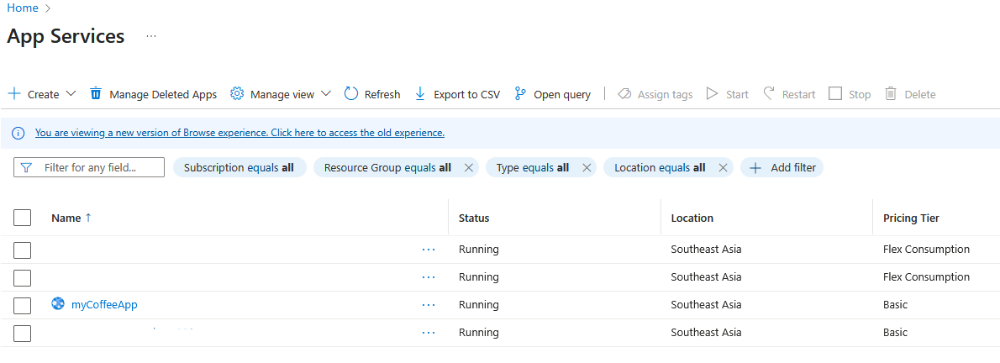
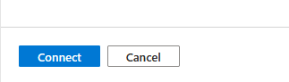

This stage focuses on our frontend application. We will create an Azure App Service to host our Python-based web application, which will serve as the user interface for entering city information and displaying discounts. The significant accomplishment here is integrating this App Service with its own dedicated subnet in the VNet. This enables the App Service to securely make outbound calls to our Azure Function over the private network, avoiding the public internet. 

## Instructions
Create App Service and Integrate with Dedicated Subnet

1. In the Azure portal, search for *App Services* and select it:
   
      

2. Click `+ Create` and select `Web App`:
   
      

3. Configure Basics:

      * Subscription: Select your subscription.
      * Resource Group: Choose `Coffee-RG`.
      * Name: Provide a globally unique name for your app (e.g., myCoffeeApp).
      * Publish: Select `Code`.
      * Runtime stack: Select `Python 3.12`.
      * Operating System: Select `Linux`.
      * Region: Select the same region as your VNet and Function App.
      * Pricing Plan: Should be `Basic B1`. 
      If pricing Plan is not set automatically to *Basic B1* `Create new` Basic B1 app service plan.

          

4. Review and Create: `Click Review + create` and then `Create`:
   
      

      Keep all other configuration as default and proceed with the App Service creation.

5. In the Azure portal, search for *App Services* and select it. Find the newly deployed App service:
      
      

6. In the left menu, under Settings, select Networking:
      
      

7. Under `Outbound traffic configuration`, next to `Virtual network integration`, click` Not configured` to configure:

      

8. Click `Add virtual network integration`:
   
      

9. Configure VNET integration settings:
      * App Service Plan connections: Select `New connection`.
      * Subscription: Select allocated subscription.
      * Virtual Network : Select `Coffee-Shop-VNET`. this is the VNEt we initally create with step 01.
      * Subnet: Select `AppServiceSubnet`. 

      

10. Click `Connect`.
     
      

