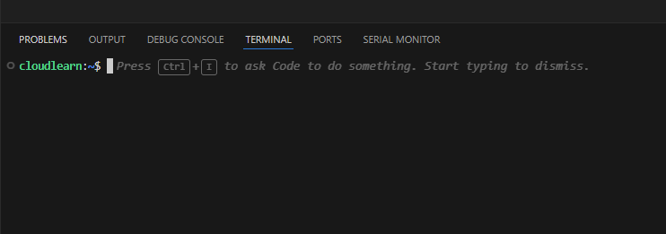

In the final stage, we bring our code to life in the Azure environment. We'll utilize the Azure Command-Line Interface (CLI) to efficiently deploy our Python frontend application to the App Service and our Python function code to the Azure Function App and do the integration between componenets using environment configurations. This step demonstrates a common and robust method for automated deployments, ensuring our entire solution is running and accessible. Upon completion, you'll be able to access your App Service, input a city, and receive a discount from the Function App, all communicating securely over your integrated VNet.

## Instructions.
Publish Code to App Service and Function App using Azure CLI

1.  Open Visual Studio Code and Integrated Terminal. You can do this in a few ways:

    ```
    * Go to **Terminal > New Terminal** from the top menu.
    * Use the keyboard shortcut:
        * Windows/Linux: `Ctrl + `` (backtick)
        * macOS: `Cmd + `` (backtick)
    ```
    

    A terminal window will appear at the bottom of your VS Code interface.

2. Initiate Azure Login. In the VS Code integrated terminal, type the following command and press Enter:

    ```bash
    az login
    ```
    
   

3. Complete Authentication in Your Browser. Upon executing `az login`, your default web browser will automatically open a new tab and redirect you to the Azure login page:

      * **Follow the prompts:** Enter your Azure account credentials (email, password, MFA if configured).
      * **Success Message:** Once authenticated, the browser tab will display a message indicating that you have successfully logged in and can close the window.

    Back in your VS Code terminal, you will see a JSON output showing your subscription details, including your tenant ID, user information, and the default subscription you are logged into.


      ```bash
        {
        "cloudName": "AzureCloud",
        "homeTenantId": "xxxxxxxx-xxxx-xxxx-xxxx-xxxxxxxxxxxx",
        "id": "yyyyyyyy-yyyy-yyyy-yyyy-yyyyyyyyyyyy",
        "isDefault": true,
        "managedByTenants": [],
        "name": "My Azure Subscription",
        "state": "Enabled",
        "tenantId": "xxxxxxxx-xxxx-xxxx-xxxx-xxxxxxxxxxxx",
        "user": {
            "name": "your_email@example.com",
            "type": "User"
        }
        }
      ```

   


4. Azure Function Code deployment:

      Navigate to your function's root directory (where host.json and your function folders like CoffeeDiscountFunc are located).In your root project folder, run this func azure functionapp publish command:

      ``` bash
      func azure functionapp publish coffeeDiscountFunc 
      
      ```
      
      This command will zip your current directory's content and deploy it.

  ## To run this command we need to install Azure Function Core Tools.  

5. After deployin the code please go to function app in Azure portal and check for availble Functions in Overview page:

      

6. Get the Function URL for the deployed Azure Function: Under the function's overview, click Get Function URL. Copy `default`  URL. 
   
   
   
  Notice. You'll need this for your App Service.
   
7.  Let's deploy code snippet to Azure app Service: 
   Navigate to your App Service's root directory (where host.json and your function folders like CoffeeDiscountFunc are located).In your root project folder,

      Run following command to Create a Zip Archive of Your Application:

      ``` bash
      zip -r myCoffeeApp.zip . -x ".*" -x "*__pycache__*" -x "*.venv*"
      ```
      
      A file named `myCoffeeApp.zip` will be created in your current directory. You can verify this in the lab's file explorer or by running `ls -l`.
            
      

8.  Run the following command to Enable Build Automation for Python Apps: (Important!)

    ```bash
    az webapp config appsettings set --name YOUR_WEB_APP_NAME \
    --resource-group YOUR_RESOURCE_GROUP_NAME \
    --settings SCM_DO_BUILD_DURING_DEPLOYMENT=true
    ```
    * **Replace:** `YOUR_WEB_APP_NAME` and `YOUR_RESOURCE_GROUP_NAME` with your actual Azure Web App's name and its resource group.
  
   This application setting (`SCM_DO_BUILD_DURING_DEPLOYMENT`) ensures Azure automatically runs the build process (including `requirements.txt` installation) during deployment.


9. Run the following command to Upload and Deploy the Zip Package to Azure Web app:

   ```bash
    az webapp deploy --resource-group YOUR_RESOURCE_GROUP_NAME \
    --name YOUR_WEB_APP_NAME \
    --src-path myCoffeeApp.zip \
    --type zip
    ```
   * **Expected Output:** Messages in your lab's terminal indicating upload progress and successful deployment. This might take a few minutes.

10.   Run the following command to setup the *FUNCTION URL* for the Azure Function: 

    ```bash
    az webapp config appsettings set --name YOUR_WEB_APP_NAME \
    --resource-group YOUR_RESOURCE_GROUP_NAME \
    --settings FUNCTION_URL=< FUNCTION URL from step 06>
    ```
    * **Replace:** `YOUR_WEB_APP_NAME` and `YOUR_RESOURCE_GROUP_NAME` with your actual Azure Web App's name and its resource group.

11. Test the Application: 
      Navigate to your App Service's URL (e.g., https://coffeeFrontendApp.azurewebsites.net).

      Enter a city and observe the coffee discount result, which confirms the App Service is communicating with the Function App via the VNet.

    

     

